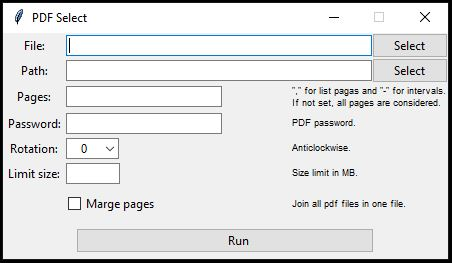

 

# PDF Select

## Overview
PDF Select allows you to select pages, split large PDF files and merge PDF files. You can perform these actions on a single file or multiple files within a directory.

## Installation
Simply download the `pdf_select.pyw` file and run it.

## Dependencies
This script requires Python 3.7 or later and PyPDF2 3 module. However, there's no need to worry. The script will attempt to install PyPDF2 if it is not already available. If the script is unable to install PyPDF2, you can manually download the [PyPDF2-3.0.1-py3-none-any.whl](/PyPDF2-3.0.1-py3-none-any.whl) file, place it in the same directory as the `pdf_select.pyw` file, and try running the script again.